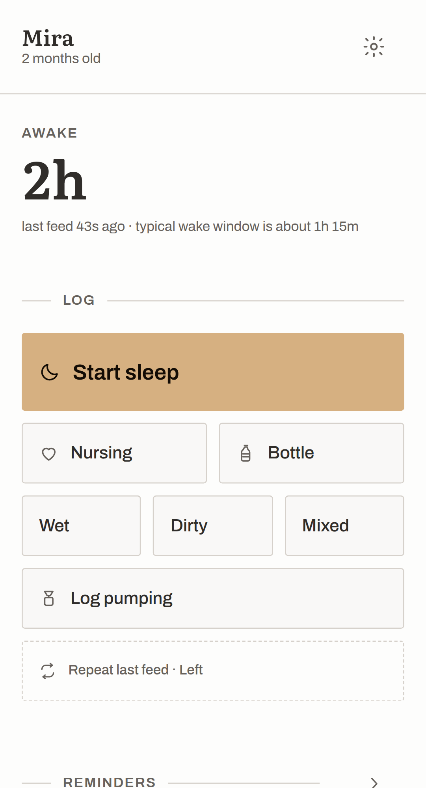
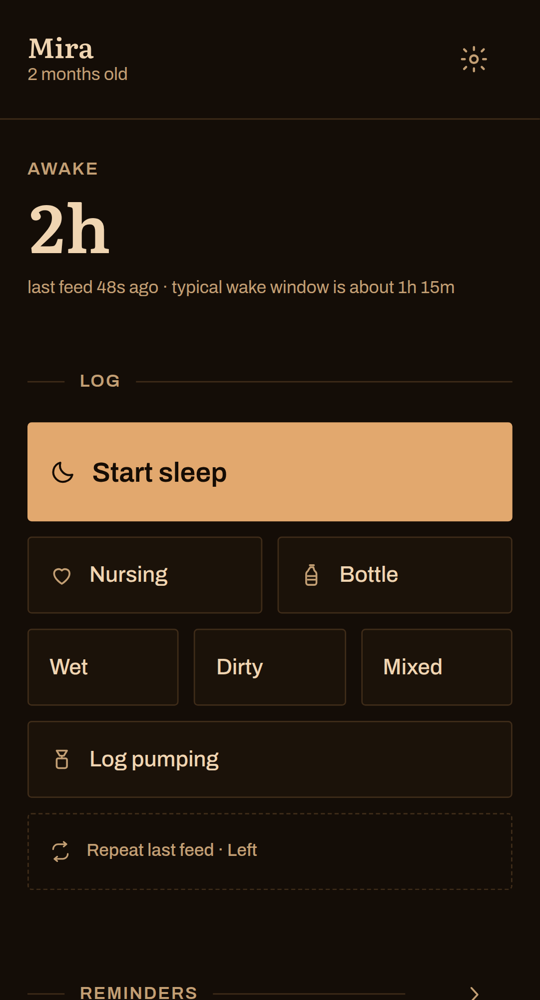
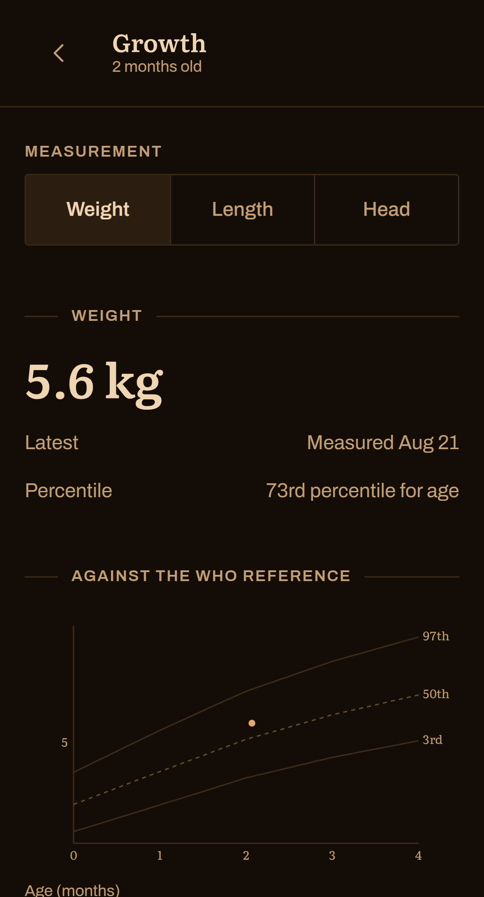
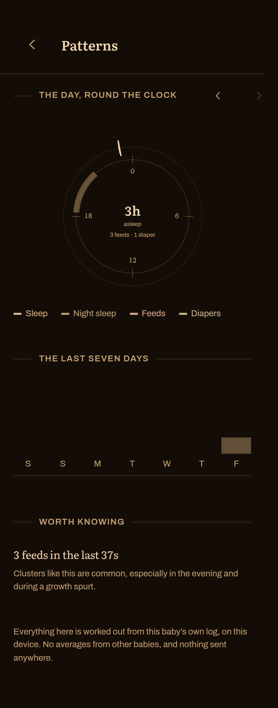
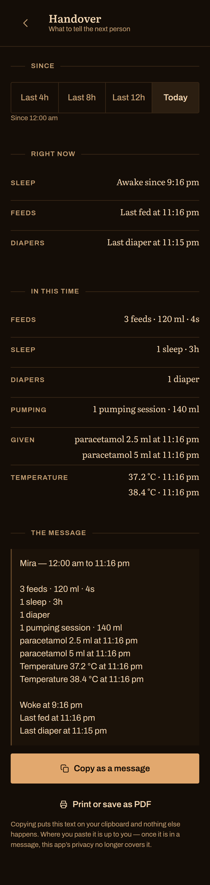
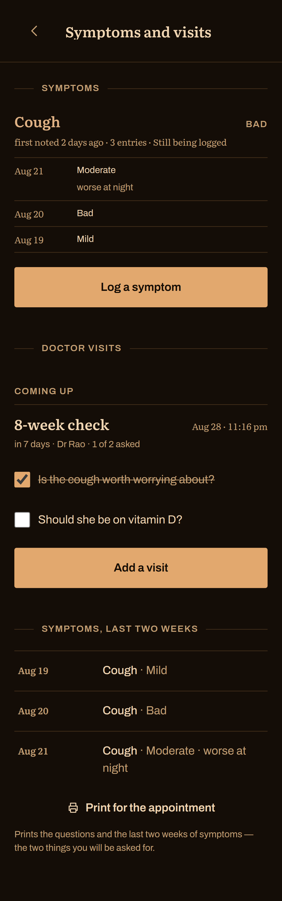

# Baby Tracker

**A private, offline-first baby tracker. Free forever, no account, no ads, no telemetry.**

Feeds, sleep and diapers in one tap — designed to be used one-handed, in the dark,
while holding a baby. Everything is stored on your own device. There is no server
to sign up to, because there is no server.

[](https://github.com/beingmechon/baby-tracker/actions/workflows/ci.yml)
[](./LICENSE)

<p align="center">
  
  
  
</p>
<p align="center">
  
  
  
</p>

---

## Why this exists

Every good baby tracker paywalls the parts you need most. Sleep predictions cost
$69/year in one popular app. Unlimited history, growth charts, extra caregivers —
all behind subscriptions, in an app that also wants your account, your email and
your baby's data on someone else's server.

Meanwhile the best open-source option, [Baby Buddy](https://github.com/babybuddy/babybuddy),
is excellent but web-first: it needs a server you host and maintain, which rules
it out for most parents.

So this project aims at the gap:

1. **Free forever what others paywall** — sleep patterns, unlimited history,
   unlimited caregivers, every chart.
2. **Truly private** — no account, works fully offline, your data never leaves
   your device unless you choose to sync it.
3. **Global** — country-specific vaccination schedules and translations from the
   start, not US-only.
4. **Install and go** — a real app on your phone, with no server to run.

## What works today

This is an early release, deliberately small, and genuinely usable right now:

- **Feeding** — nursing stopwatch with per-side timing that remembers the last
  side used and suggests the other one; bottle logging with one-tap amounts in ml
  or oz, breast milk or formula.
- **Sleep** — one big start/stop timer, automatically classified as a nap or
  night sleep based on your own night hours. The timer survives closing the app.
- **Diapers** — wet, dirty and mixed in a single tap each.
- **Repeat last feed** — one tap re-logs whatever you logged last.
- **Unified timeline** — every event in one feed, per day, all of it editable.
- **Daily summary** — feed count and volume, total and longest sleep, diaper
  counts, all correct across midnight.
- **Night mode** — a dim, red-tinted theme that switches on automatically during
  your night hours. Huge tap targets throughout.
- **Works offline** — install it to your home screen and it opens and logs with
  no connection at all.
- **Growth with real WHO percentile charts** — weight, length and head
  circumference, in metric or imperial, plotted against the World Health
  Organization's own reference curves. Gain per week between weigh-ins. This is
  the feature most trackers put behind a subscription; here it is just part of the
  app.
- **Temperature and medication** — readings compared against the figure health
  services publish rather than diagnosed, and a dose log that answers "when did we
  last give this?"
- **Pumping and a milk stash** — per-side output with a session clock, plus fridge
  and freezer stock listed in the order to use it, each container measured against
  its own storage guideline.
- **Sleep patterns, free** — the next nap predicted from this baby's own wake
  windows (with the spread it is honest about, and no prediction at all from too
  few data points), a 24-hour day wheel, a week of nights and naps stacked, the
  trend against last week, and cluster feeding named when it happens. All of it
  computed on the device. This is the $69-a-year feature.
- **A symptom diary and doctor visits** — entries group into episodes, so the
  answer to "when did this start?" is "cough, four days, worse yesterday" instead
  of twelve scattered lines. Appointments can be dated in the future with the
  questions you thought of at 3am, ticked off in the room, and printed with the
  last two weeks of symptoms. It records; it does not assess.
- **Handover** — pick a shift (last 4, 8 or 12 hours, or today), see what happened
  and when they last ate, slept and were changed, then copy it as a plain-text
  message or print it for a nursery. Copying puts text on your clipboard; nothing
  is sent anywhere.
- **More than one baby** — switch from the app bar; each one's log, growth and
  reminders are entirely their own.
- **Reminders** — next feed, diaper, pumping or anything you name, snoozeable, and
  counted from your own log rather than from when the reminder last went off.
- **Your language** — every string is translatable, with plurals, locale-aware
  clocks and numbers, and a language picker.
- **Your data is yours** — full JSON backup, CSV export for the paediatrician,
  JSON import, and one-tap deletion of everything.

See the [roadmap](docs/ROADMAP.md) for what is coming and how to help.

## Try it

**On your phone (recommended):** open the app, then use *Add to Home Screen*
(Share menu in Safari, or the install prompt in Chrome). It then behaves like any
other app, works offline, and never asks you to sign in.

**Run it locally:**

```bash
git clone https://github.com/beingmechon/baby-tracker.git
cd baby-tracker
npm install
npm run dev
```

Then open the printed URL. That is the whole setup — no database, no API keys,
no configuration.

## Is my data safe?

Yes, and you do not have to take our word for it — check the code.

- Everything lives in IndexedDB on your device. There is no network call anywhere
  in the app except loading the app itself.
- No account, no analytics SDK, no crash reporting, no ad network, no third-party
  scripts of any kind.
- Export a complete backup whenever you like; delete everything in one tap.

Read [PRIVACY.md](PRIVACY.md) for the specifics, and
[SECURITY.md](SECURITY.md) to report a problem.

Because everything is local, **your data is only as safe as your device**. Clearing
your browser's site data deletes it, so export a backup now and then.

## Not a medical device

This app records what you tell it and shows you your own numbers back. It does not
diagnose anything, and it is not a substitute for your paediatrician. If you are
worried about your baby, call a doctor. See
[MEDICAL_DISCLAIMER.md](docs/MEDICAL_DISCLAIMER.md).

## Contributing

Contributions are very welcome, especially from parents who will actually use
this. You do not need to be an expert — some of the most valuable contributions
are "this wording confused me at 3am" and "this button is hard to hit one-handed".

- [CONTRIBUTING.md](CONTRIBUTING.md) — how to get set up and what to work on
- [docs/ARCHITECTURE.md](docs/ARCHITECTURE.md) — how the code is organised and why
- [docs/DESIGN.md](docs/DESIGN.md) — the design contract; read it before changing the UI
- [docs/ROADMAP.md](docs/ROADMAP.md) — the full feature plan, version by version
- Good first issues are labelled [`good first issue`](https://github.com/beingmechon/baby-tracker/labels/good%20first%20issue)

Translations, country-specific vaccination schedules and accessibility fixes are
particularly wanted.

## Design

The look is not improvised. It has a written contract in
[docs/DESIGN.md](docs/DESIGN.md): a named direction ("Herbarium Grid"), a stated
grounding, and a rule for every choice.

Warm natural materials on a strict module grid. Serif numerals as the protagonist —
in a tracker the numbers *are* the content — with a quiet grotesque receding behind
them. Hairline rules instead of cards. Everything flush-left. One ochre accent that
appears only on a running timer and the primary action, and nowhere else. Section
labels interrupt their own rule, like a legend on a map frame; that is the only
ornament in the app.

Three themes, because "dark mode" is not enough: light, dark, and a dim red-shifted
**night** theme for the small hours, when the screen is inches from a sleeping
baby's face. One warm hue family carries all three.

It was derived using [ryanthedev/design-for-ai](https://github.com/ryanthedev/design-for-ai),
whose AI-tell catalog ports rules from
[pbakaus/impeccable](https://github.com/pbakaus/impeccable) — the composition came
from its seeded dealer rather than from anyone's taste, the colour ramps are
generated OKLCH with WCAG contrast solved by construction (16/16 pairs pass), and
the result is checked by its deterministic AI-tell detector: **0 findings across 31
screens and 16 rules**, down from 13.

## Tech

React + TypeScript + Vite, as an offline-first PWA. No UI framework, and two
runtime dependencies (React and React DOM). About 300 KB precached in total,
fonts included — downloaded once, then it runs offline forever.

```
src/domain/   Pure logic: units, time, sleep classification, summaries. No I/O.
src/data/     Storage behind one Repository interface (IndexedDB today).
src/app/      React state: settings, theme, the nursing timer, the store.
src/ui/       Components.
src/styles/   Tokens, base, components, and the two self-hosted fonts.
```

The domain and data layers are deliberately free of React, so a native shell or a
sync server can reuse them unchanged. 156 unit tests cover the logic, plus a
browser smoke test that verifies the app still works with the network off — and
that its numerals are genuinely tabular, so a running timer cannot jitter.

```bash
npm test          # unit tests
npm run check     # lint, typecheck, tests and a production build
npm run smoke     # end-to-end run in a real browser (needs a built app)
npm run fonts     # re-vendor the woff2 files from node_modules
```

## License

[AGPL-3.0-or-later](./LICENSE).

Chosen deliberately: anyone may use, study, change and share this app, but any
fork — including one offered to people over a network — has to stay open source
too. This app exists because parents' basic tracking got locked behind
subscriptions; the licence makes it hard for that to happen to this code.

---

Built for peer parents, by parents. If it helps you through a hard night, that
was the whole point.
